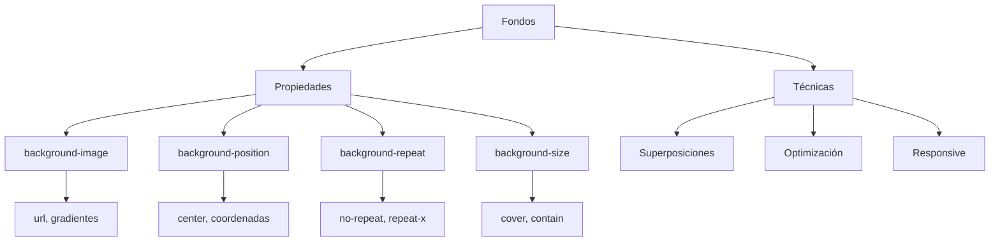

---

tags: css/backgrounds, frontend

parent: [[CSS]]

---

# Fondos E Imágenes

Control de fondos y decoración visual de elementos.

---

## `background` (Propiedad abreviada)

Combina múltiples propiedades de fondo en una declaración.

```css
.elemento {
  background: color url(ruta) repeat posición/tamaño;
}
```

**Ejemplo completo:**

```css
.hero {
  background: #1a1a1a url("hero.jpg") no-repeat center center/cover;
}
```

**Componentes incluidos:**
- `background-color`
- `background-image`
- `background-repeat`
- `background-position`
- `background-size`

**Relacionado:** [[background-image]], [[background-position]]

---

## `background-image`

Establece una o varias imágenes de fondo.

```css
body {
  background-image: url("textura.png"), linear-gradient(to bottom, #000, #333);
}
```

**Usos comunes:**
- Texturas o patrones
- Degradados combinados con imágenes
- Efectos de superposición

**Buenas prácticas:**
- Usar formatos modernos (WebP)
- Combinar con `background-color` como fallback
- Optimizar peso de imágenes

**Relacionado:** [[CSS Gradients]], [[image optimization]]

---

## `background-repeat`

Controla la repetición de la imagen de fondo.

```css
.elemento {
  background-repeat: repeat | no-repeat | repeat-x | repeat-y | space | round;
}
```

**Casos típicos:**

```css
/* Logo único centrado */
.logo {
  background-repeat: no-repeat;
}

/* Patrón horizontal */
.banner {
  background-repeat: repeat-x;
}

/* Mosaico adaptativo */
.textura {
  background-repeat: round;
}
```

**Relacionado:** [[background-position]], [[background-size]]

---

## `background-position`

Define la posición inicial de la imagen de fondo.

```css
.elemento {
  background-position: center top; /* X Y */
  background-position: 20% 80%;   /* Coordenadas */
  background-position: right 10px bottom 20px; /* Offset */
}
```

**Valores clave:**

| Combinación          | Efecto                       |
|----------------------|------------------------------|
| `center center`      | Centrado completo            |
| `left top`           | Esquina superior izquierda   |
| `right bottom`       | Esquina inferior derecha     |

**Ejemplo con offset:**

```css
.notificacion {
  background-position: right 10px bottom 20px; /* 10px del borde derecho, 20px del inferior */
}
```

**Relacionado:** [[positioning]], [[spacing]]

---

## `background-size`

Controla el tamaño de la imagen de fondo.

```css
.elemento {
  background-size: cover | contain | 100% auto | 300px 200px;
}
```

**Estrategias comunes:**
- `cover`: Cubre todo el contenedor (puede recortar)
- `contain`: Muestra imagen completa (puede dejar espacios)
- Valores exactos: `width height`

**Ejemplo responsive:**

```css
.card {
  background-size: contain;
  background-position: center;
}
```

**Relacionado:** [[responsive design]], [[aspect-ratio]]

---

## Combinaciones Prácticas

1. Hero section fullscreen:

```css
.hero {
  background: url("fondo.jpg") no-repeat center center/cover fixed;
  height: 100vh;
}
```

2. Patrón de textura con degradado:

```css
body {
  background: 
    linear-gradient(rgba(0,0,0,0.5), rgba(0,0,0,0.5)),
    url("textura.png") repeat;
}
```

3. Icono posicionado:

```css
.boton {
  background: url("icono.svg") no-repeat right 15px center;
  padding-right: 40px;
}
```

---

## Mapa Conceptual



