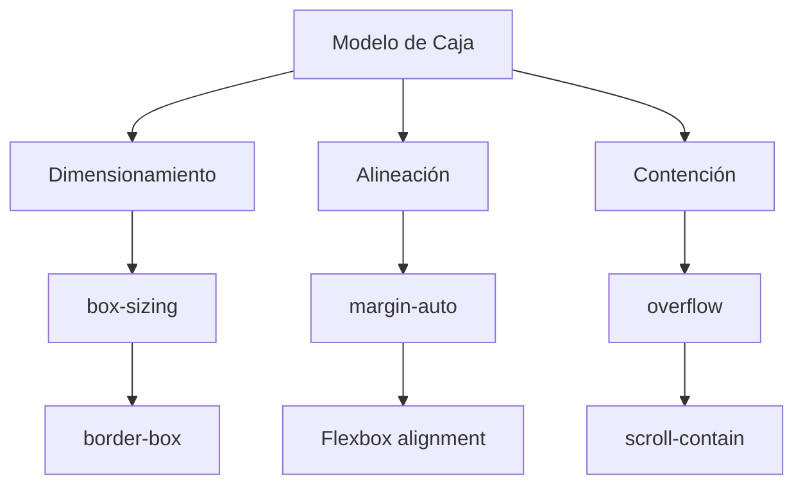

---

tags: css/box-model, frontend

parent: [[CSS]]

---

# Modelo De Caja Avanzado

Control preciso del flujo y dimensionamiento de elementos.

---

## `margin-right: auto`

**Técnica de alineación** para empujar elementos hacia un lado en contenedores flexibles.

```css
.logo {
  margin-right: auto; /* Empuja el logo a la izquierda */
}
```

**Casos de uso:**
- Crear espacio desigual entre elementos en Flexbox
- Alinear elementos a extremos opuestos
- Reemplazar floats en diseños modernos

**Ejemplo en navbar:**

```css
nav {
  display: flex;
  padding: 1rem;
}

.logo {
  margin-right: auto; /* Elementos posteriores van a la derecha */
}
```

**Relacionado:** [[Flexbox]], [[margin collapsing]]

---

## `overflow`

Controla el comportamiento del contenido que excede el contenedor.

```css
.contenedor {
  overflow: visible | hidden | scroll | auto | clip;
}
```

**Valores clave:**

| Valor     | Comportamiento               | Uso típico            |
|-----------|------------------------------|-----------------------|
| `hidden`  | Oculta el exceso             | Galerías, tooltips    |
| `scroll`  | Siempre muestra scroll       | Áreas de texto largas|
| `auto`    | Scroll solo si es necesario  | Contenido dinámico    |

**Ejemplo avanzado:**

```css
.galeria {
  overflow-x: auto; /* Scroll horizontal */
  overflow-y: hidden;
  white-space: nowrap;
}
```

**Relacionado:** [[positioning]], [[Flexbox]]

---

## `box-sizing`

Determina cómo se calculan las dimensiones del elemento.

```css
.elemento {
  box-sizing: content-box | border-box;
}
```

**Comparación:**

```css
/* content-box (default) */
width = contenido + padding + border

/* border-box (recomendado) */
width = contenido (incluye padding y border)
```

**Mejor práctica:**

```css
/* Reset global para diseño predecible */
* {
  box-sizing: border-box;
}
```

**Ejemplo práctico:**

```css
.caja {
  width: 300px;
  padding: 20px;
  border: 2px solid red;
  /* Con border-box: ancho total = 300px */
  /* Con content-box: ancho total = 344px */
}
```

**Relacionado:** [[responsive design]], [[padding]]

---

## Combinaciones Útiles

1. Layout predecible:

```css
* {
  box-sizing: border-box;
  margin: 0;
  padding: 0;
}
```

2. Scroll suave:

```css
.contenido {
  overflow: auto;
  scroll-behavior: smooth;
}
```

3. Alineación compleja:

```css
.header {
  display: flex;
}

.menu {
  margin-left: auto; /* Empuja el menú a la derecha */
  margin-right: 20px;
}
```

---

## Mapa Conceptual



