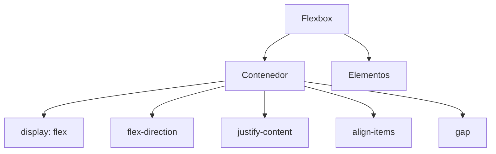

tags: css/flexbox, frontend

parent: [[CSS]]

---

# Flexbox

Sistema de diseño unidimensional para organizar elementos en filas o columnas.

---

## `display: flex`

**Propiedad del contenedor** que activa el modelo Flexbox.

```css
.contenedor {
  display: flex;
}
```

**Comportamiento:**
- Los elementos hijos se convierten en **flex items**
- Dirección principal por defecto: `row` (fila)
- Sin saltos de línea por defecto

---

## `flex-direction`

Define la **dirección principal** de los elementos.

```css
.contenedor {
  flex-direction: row | column | row-reverse | column-reverse;
}
```

**Valores:**
- `row` (default): Izquierda a derecha
- `column`: Arriba a abajo
- `*-reverse`: Invierte el orden

**Ejemplo visual:**

```
row → [A][B][C]
column ↓
 [A]
 [B]
 [C]
```

---

## `justify-content`

Controla la alineación en el **eje principal**.

```css
.contenedor {
  justify-content: flex-start | flex-end | center | space-between | space-around | space-evenly;
}
```

**Casos comunes:**
- `center`: Centrado horizontal (si dirección es row)
- `space-between`: Espacios iguales entre elementos
- `space-around`: Espacios alrededor de elementos

**Diagrama:**

```
|◼◼◼◼◼|  flex-start
|  ◼◼◼  |  center
|◼ ◼ ◼|  space-between
```


---

## `align-items`

Alineación en el **eje transversal** (perpendicular al principal).

```css
.contenedor {
  align-items: stretch | flex-start | flex-end | center | baseline;
}
```

**Usos típicos:**
- `center`: Centrado vertical (si dirección es row)
- `stretch` (default): Estira elementos para llenar contenedor

**Ejemplo con `flex-direction: row`:**

```
|‾‾‾‾‾|
|  ◼  | ← Centrado vertical
|_____|
```


---

## `gap`

Espacio entre elementos flexibles.

```css
.contenedor {
  gap: 10px; /* Espacio uniforme */
  gap: 20px 10px; /* row-gap column-gap */
}
```

**Ventajas:**
- Reemplaza el uso de margins entre elementos
- Responsive: fácil de ajustar
- No afecta los bordes del contenedor


---

## Combinaciones Comunes

1. Centrado perfecto:

```css
.contenedor {
  display: flex;
  justify-content: center;
  align-items: center;
}
```

2. Menú horizontal espaciado:

```css
nav {
  display: flex;
  justify-content: space-between;
  gap: 1rem;
}
```

3. Tarjetas en columna:

```css
.card-container {
  display: flex;
  flex-direction: column;
  gap: 2rem;
}
```

---

## Mapa Mental



