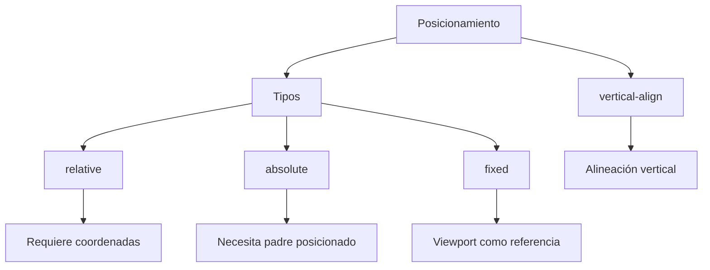

---

tags: css/positioning, frontend

parent: [[CSS]]

---

# Posicionamiento

Control de ubicación precisa de elementos en la pantalla.

---

## `position`

Define el método de posicionamiento de un elemento.

```css
.elemento {
  position: static | relative | absolute | fixed | sticky;
}
```

### Valores Clave:

1. **relative**:
   - Se posiciona **relativo a su posición original**
   - Mantiene su espacio en el flujo del documento

   ```css
   .caja {
     position: relative;
     top: 10px;
     left: 20px;
   }
   ```

2. **absolute**:
   - Se posiciona **relativo al ancestro posicionado más cercano** (≠ static)
   - Se remueve del flujo normal del documento

   ```css
   .menu {
     position: absolute;
     top: 100%;
     left: 0;
   }
   ```

3. **fixed**:
   - Posicionamiento **relativo al viewport**
   - Mantiene su posición aunque se haga scroll

   ```css
   .header {
     position: fixed;
     top: 0;
     left: 0;
     width: 100%;
   }
   ```

**Regla clave:**
`absolute` requiere un padre con `position: relative` para usar coordenadas relativas al contenedor.

**Relacionado:** [[z-index]], [[display]]

---

## `vertical-align`

Controla la alineación vertical de elementos **inline** o **table-cell**.

```css
.elemento {
  vertical-align: top | middle | bottom | baseline | text-top;
}
```

**Usos comunes:**
- Alinear iconos con texto
- Ajustar imágenes en celdas de tabla
- Corregir desalineaciones en elementos inline-block

**Ejemplo práctico:**

```html
<button>
  
  <span style="vertical-align: middle">Texto</span>
</button>
```

**Limitaciones:**
No funciona con elementos `block` (solo inline/inline-block/table-cell)

**Relacionado:** [[line-height]], [[display]]

---

## Combinaciones Útiles

1. Menú desplegable (absolute + relative):

```css
.contenedor {
  position: relative;
}

.submenu {
  position: absolute;
  top: 100%;
  left: 0;
}
```

2. Header fijo con contenido ajustado:

```css
header {
  position: fixed;
  height: 60px;
}

main {
  padding-top: 60px; /* Compensa altura del header */
}
```

3. Superposición de elementos:

```css
.imagen {
  position: relative;
}

.badge {
  position: absolute;
  top: -10px;
  right: -10px;
}
```

---

## Mapa Conceptual


