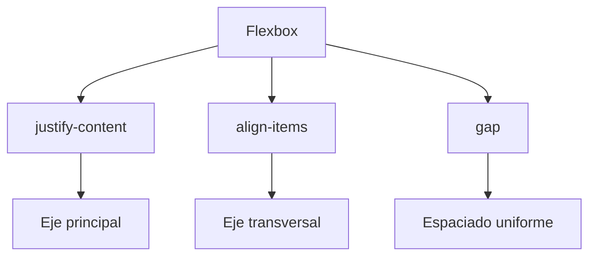
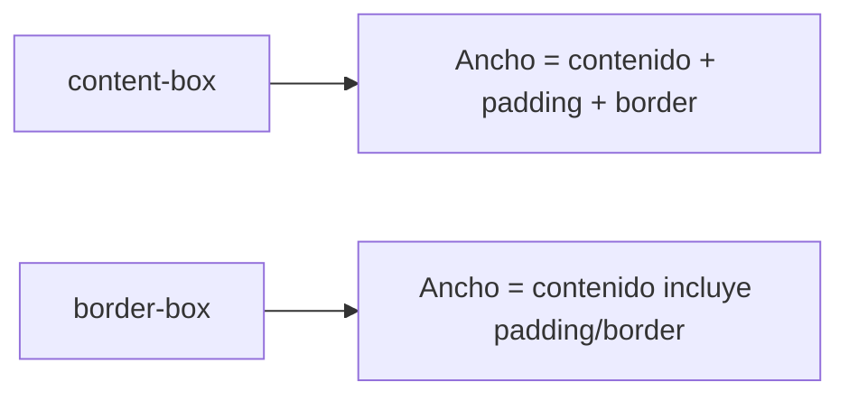
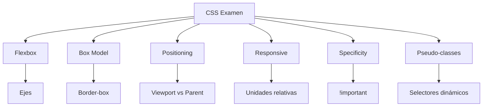

---

tags: css/examen, frontend

parent: [[CSS]]

---

# Conceptos Clave Para El Examen

Guía rápida de los temas esenciales de CSS.

---

## 1. Flexbox

**Ejes principales y propiedades:**



### `justify-content`

```css
.contenedor {
  justify-content: flex-start | center | space-between | space-around;
}
```

- Controla distribución en **eje principal**
- `space-between`: elementos pegados a extremos
- `center`: centrado horizontal en rows

### `align-items`

```css
.contenedor {
  align-items: stretch | center | baseline;
}
```

- Alineación en **eje transversal**
- `stretch` (default): estira elementos
- `center`: centrado vertical en rows

### `gap`

```css
.contenedor {
  gap: 10px; /* Espacio entre elementos */
}
```

- Reemplaza `margin` hack
- Acepta 2 valores: `row-gap column-gap`

[[Flexbox]]

---

## 2. Modelo De Caja



**Comparación:**

```css
.caja {
  width: 300px;
  padding: 20px;
  border: 5px solid;
}

/* content-box: 300 + 40 + 10 = 350px */
/* border-box: 300px (todo incluido) */
```

---

## 3. Posicionamiento

**Diferencias clave:**

| Propiedad | Contexto             | Scroll | Flujo Doc.  | Uso común           |
|-----------|----------------------|--------|-------------|---------------------|
| `relative`| Posición original    | Sí      | Mantenido   | Ajustes menores     |
| `absolute`| Ancestro posicionado | Sí      | Eliminado   | Menús desplegables  |
| `fixed`   | Viewport             | No      | Eliminado   | Headers/Modales     |

**Regla mnemotécnica:**
"Absolute busca papás posicionados, Fixed siempre queda pegado"

---

## 4. Unidades Responsivas

**Comparativa:**

| Unidad | Relativo a                | Recomendado para          |
|--------|---------------------------|---------------------------|
| `%`    | Elemento padre            | Contenedores fluidos      |
| `rem`  | Tamaño de letra raíz      | Tipografía, márgenes      |
| `vw/vh`| Viewport width/height     | Full-screen sections      |
| `em`   | Tamaño de letra del padre | Componentes anidados      |

**Ejemplo responsive:**

```css
.contenedor {
  width: 90%; /* Padre */
  padding: 2rem; /* Escalable */
  height: 50vh; /* Mitad viewport */
}
```

---

## 5. Especificidad Css

**Orden de prioridad:**
1. `!important`
2. Estilos inline (`style=""`)
3. `#id`
4. `.clase`, `[atributos]`, `:pseudo-classes`
5. `elementos`, `::pseudo-elements`

**Calculadora de peso:**
`0-0-0` (ID - Clase - Elemento)
Ejemplo: `#nav .item:hover` = `1-2-0`

---

## 6. Pseudo-clases

**Selector de hijos:**

```css
/* Último elemento */
li:last-child { border: none; }

/* Primer elemento de tipo */
p:first-of-type { font-size: 1.2em; }

/* Cada 3er elemento */
div:nth-child(3n) { background: #eee; }
```

**Combinaciones útiles:**

```css
/* Menú interactivo */
nav a:hover {
  color: red;
  transition: color 0.3s;
}

/* Tablas zebra */
tr:nth-child(odd) {
  background: #f5f5f5;
}
```

---

## Mapa Mental Global



---

## Preguntas Frecuentes

1. **¿Qué tiene más prioridad: .clase o id?**
   `#id` gana sobre `.clase` (especificidad 1-0-0 vs 0-1-0)

2. **¿`position: absolute` respecto a qué se posiciona?**
   Del ancestro más cercano con `position ≠ static`

3. **¿Cuándo usar rem vs em?**
   Usar `rem` para escalado global, `em` para componentes independientes

4. **¿Cómo centrar verticalmente con Flexbox?**
   `display: flex; align-items: center;`
