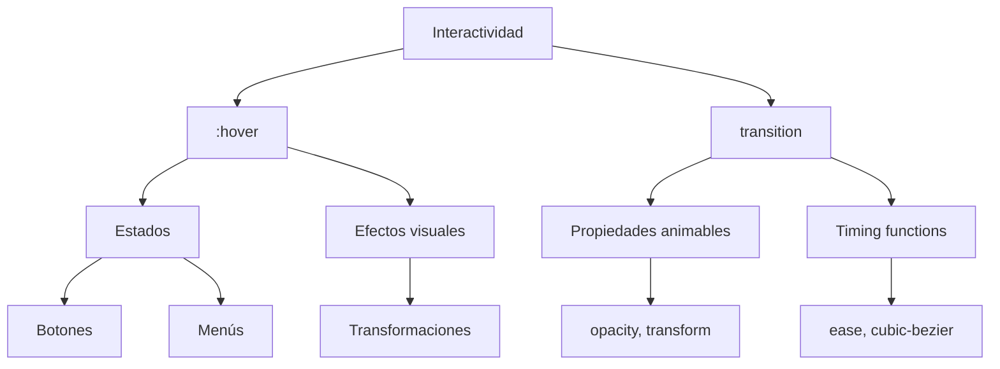

---

tags: css/interactivity, frontend

parent: [[CSS]]

---

# Efectos E Interactividad

Técnicas para crear elementos dinámicos y responsivos a la interacción del usuario.

---

## `:hover`

Pseudo-clase que aplica estilos **cuando el cursor está sobre el elemento**.

```css
.boton {
  background: blue;
}

.boton:hover {
  background: darkblue;
  cursor: pointer;
}
```

**Casos comunes:**
- Cambios de color en botones
- Mostrar tooltips o submenús
- Efectos de escala en imágenes
- Resaltar elementos interactivos

**Ejemplo avanzado (tooltip):**

```css
[data-tooltip]:hover::after {
  content: attr(data-tooltip);
  position: absolute;
  background: black;
  color: white;
  padding: 5px;
}
```

**Relacionado:** [[pseudo-classes]], [[cursor]]

---

## `transition`

Crea **animaciones suaves** entre cambios de estado/propiedades.

```css
.elemento {
  transition: propiedad duración timing-function delay;
}
```

### Transición Implícita (shorthand):

```css
.caja {
  transition: all 0.3s ease-in-out;
}

.caja:hover {
  transform: scale(1.1);
  opacity: 0.8;
}
```

**Propiedades clave:**

| Parámetro        | Valores típicos          |
|------------------|--------------------------|
| `propiedad`      | all, opacity, transform |
| `duración`       | 0.3s, 500ms             |
| `timing-function`| ease, linear, cubic-bezier() |
| `delay`          | 0s, 0.2s                |

**Buenas prácticas:**
- Evitar `transition: all` en producción
- Usar hardware acceleration con `transform` y `opacity`
- Combinar con `will-change` para optimización

**Relacionado:** [[animaciones CSS]], [[transform]]

---

## Combinaciones Efectivas

1. Botón interactivo:

```css
.btn {
  background: #2196F3;
  transition: background 0.2s, transform 0.1s;
}

.btn:hover {
  background: #1976D2;
  transform: translateY(-2px);
}

.btn:active {
  transform: translateY(1px);
}
```

2. Fade-in al hover:

```css
.tarjeta {
  opacity: 0.9;
  transition: opacity 0.4s;
}

.tarjeta:hover {
  opacity: 1;
}
```

3. Efecto de despliegue:

```css
.menu {
  max-height: 0;
  overflow: hidden;
  transition: max-height 0.3s ease-out;
}

.trigger:hover + .menu {
  max-height: 200px;
}
```

---

## Mapa Conceptual



